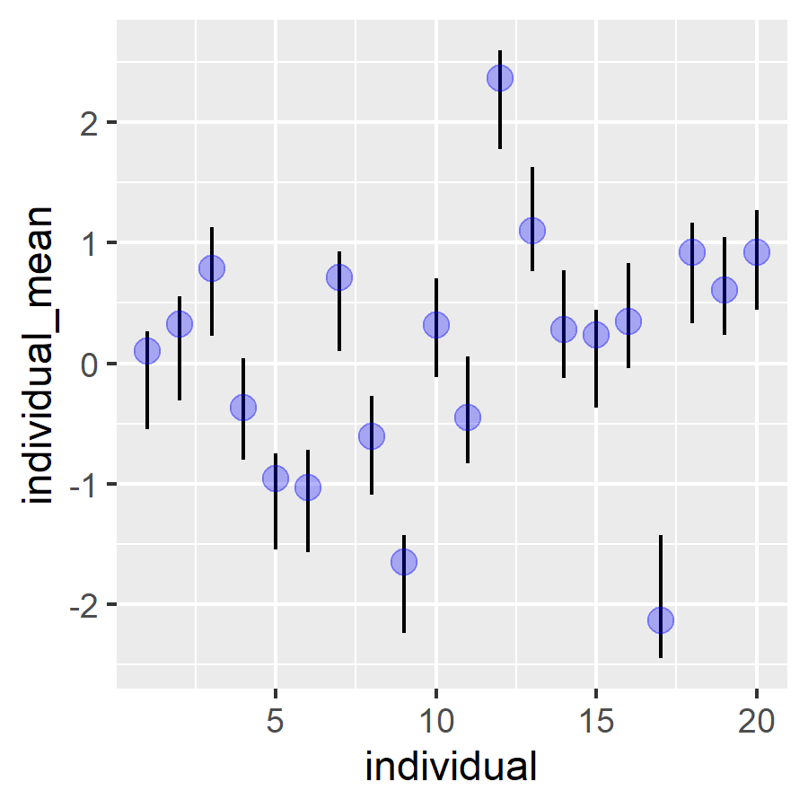
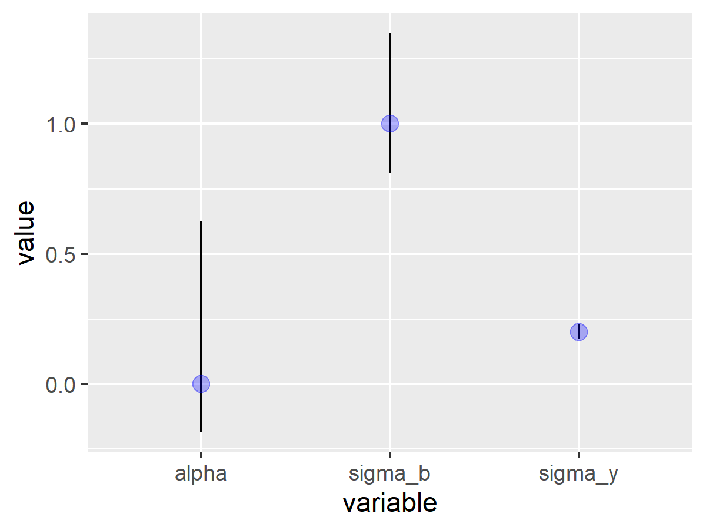
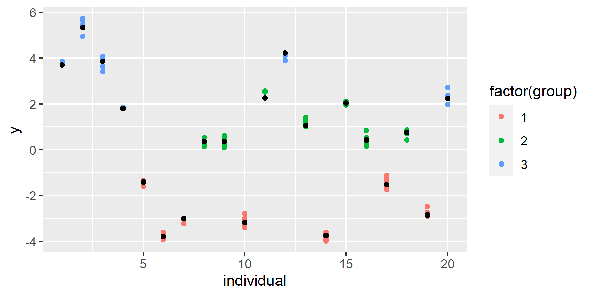
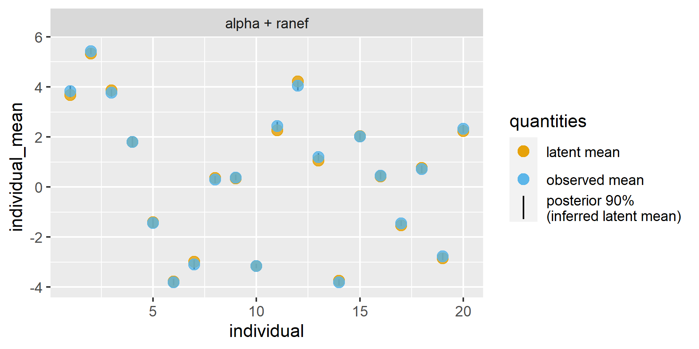

Latent class mixed effects models
================

## Background

Proust-Lima, Philipps, and Liquet (2017) describe the statistical
machinery for their latent class mixed models. We note the following
equations from their paper.

Below is the likelihood contribution for one individual in the basic
linear mixed model that we know and love:

$$
\displaylines{
L_i = \phi_i(Y_i; \theta_1) \\
\phi: \textrm{MVN density} \\
i: \textrm{individual index}
}
$$

When there are $G$ latent classes, the likelihood becomes a weighted sum
of class-specific likelihoods:

$$
\displaylines{
L_i(\theta_G) = \sum_{g=1}^G \pi_{ig}\phi_{ig}(Y_i|c_i = g; \theta_G) \\
\pi_{ig}: \textrm{probability of group membership for an individual} \\
g: \textrm{group index}
}
$$

So, an individual makes $G$ contributions to the likelihood and each one
is weighted by their group membership probability. And when there is one
group, this equation reduces to the first likelihood equation.

Finally, group probabilities are defined as a multinomial logistic
model:

$$
\displaylines{
\pi_{ig} = 
  P(c_i = g | X_{ci}) = 
  \frac{
    e^{\xi_{0g} +X^{\top}_{ci}\xi_{1g}}
  }{
    \sum^{G}_{l=1}e^{\xi_{0l} +X^{\top}_{ci}\xi_{1l}}
  } \\
c_i : \textrm{the latent class for an individual} \\
X_{ci} : \textrm{time-indpendent covariates} \\
\xi_{0g} +X^{\top}_{ci}\xi_{1g} : \textrm{linear model for group membership}
}
$$

## stan notes

Richard McElreath has a
[tutorial](https://elevanth.org/blog/2018/01/29/algebra-and-missingness/)
where observations are in different states but for some observations,
that state is missing/unobserved. He provides following recipe for how
work with discrete parameters in Stan:

> 1)  Write the probability of an outcome `y[i]` conditional on known
>     values of the discrete parameters. Call this $L$, the conditional
>     likelihood.
>
> 2)  List all the possible states the discrete parameters could take.
>     For example, if you have two binary parameters, then there are
>     four possible states: 11, 10, 01, and 00. Let $j$ be an index for
>     state, so that in this example $j$ can take the values 1, 2, 3,
>     and 4.
>
> 3)  For each state in (2), compute the probability of that state. Your
>     model provides these probabilities, and they will depend upon the
>     details of your model. Call each state’s probability $P_j$.
>
> 4)  For each state in (2), compute the probability of an outcome
>     `y[i]` when the discrete parameters take on those values. For
>     example, there is a different probability for each of 11, 10, 01,
>     and 00. You can use the expression from (1) and just insert the
>     values of the parameters for each state. Call each state’s
>     corresponding likelihood $L_j$.
>
> 5)  Now you can compute the unconditional probability of `y[i]` by
>     multiplying each $P_j$ by $L_j$. Then sum these products for all
>     states: $M=\sum_j P_j L_j$. This $M$ is the marginal likelihood,
>     the probability of `y[i]` averaging over the unknown values of the
>     discrete parameters.
>
> In the actual code, we must do all of the above on the log-probability
> scale, or otherwise numerical precision will be poor. So in practice
> each $P_j L_j$ term is computed as a sum of log probabilities:
> `term[j] = logP[j] + logL[j]`. And then we can compute $\log M$ as
> `log_sum_exp(term).`

So following that recipe and the notes from the lcmm package, I can do a
simple latent class model in Stan

``` stan

data {
  int<lower=1> n_obs;  // observations
  int<lower=1> n_groups;  // latent groups
  array[n_obs] real y;
}

transformed data {}

parameters {
  real alpha;               // fixed intercept term
  ordered[n_groups] mean_group;
  vector<lower=0>[n_groups] sigma_group;

  simplex[n_groups] probs;
}
transformed parameters{}

model {
  array[n_groups] real group_likelihoods;

  alpha ~ normal(0, .001);
  sigma_group ~ exponential(2);
  probs ~ dirichlet(rep_vector(1.0, n_groups));
  mean_group ~ normal(0, 10);

  for (i in 1:n_obs) {
    for (j in 1:n_groups) {
      group_likelihoods[j] = log(probs[j]) +
        normal_lpdf(y[i] | mean_group[j], sigma_group[j]);
    }
    target += log_sum_exp(group_likelihoods);
  }

}

generated quantities {
  matrix[n_obs, n_groups] g_probs;
  for (i in 1:n_obs) {
    vector[n_groups] terms;
    for (j in 1:n_groups) {
      terms[j] = log(probs[j]) + normal_lpdf(y[i] | mean_group[j], sigma_group[j]);
    }
    g_probs[i, ] = to_row_vector(softmax(terms));
  }
}
```

``` r
a <- rnorm(20, 100, 10)
b <- rnorm(50, 5, 1)
c <- rnorm(20, -10, 4)
c(a, b, c)[83]

# copy the example from 
# https://www.pymc.io/projects/examples/en/latest/mixture_models/gaussian_mixture_model.html
n_groups <- 3
n_obs <- 500
means <- c(-5, 0, 5)
sds = c(0.5, 2.0, 0.75)
ids <- sample(1:n_groups, n_obs, replace = TRUE)
y <- rnorm(n_obs, means[ids], sds[ids])

m <- cmdstanr::cmdstan_model("0.stan")
data <- list(
  n_obs = length(y),
  n_groups = 3,
  y = y
)
e <- m$sample(data, refresh = 0)
e_sum <- e$summary()
e_sum |> print(n = Inf)
library(dplyr)

# e$draws() |> posterior::as_draws_df()
library(ggplot2)
p <- ggplot(tibble(x = y)) + 
  aes(x = x) + geom_point(aes(y = 0), position = position_jitter(width = 0, height = .2)) + 
  ylim(-.4, .4) +
  ggtitle("data") +
  xlab("observed value") +
  ylab("(jittered)")

x <- e$draws() |> 
  posterior::as_draws_df() |>
  select(.draw, starts_with("mean_"), starts_with("probs"), starts_with("sigma")) |> 
  tidyr::pivot_longer(
    cols = c(-.draw), 
    names_pattern = "(.+)\\[(\\d+)\\]",
    names_to = c("family", "index")
  ) |> 
  mutate(parameter = sprintf("%s[%s]", family, index))

ggplot(x) + aes(x = value, y = parameter) + 
  ggdist::stat_halfeye() + 
  facet_wrap("family", scales = "free")

p2 <- bayesplot::mcmc_intervals_data(e$draws(), pars = vars(starts_with("mean_group"), starts_with("probs"))) |>
  mutate(facet = stringr::str_remove_all(parameter, "\\[\\d+\\]")) |> 
  ggplot() + aes(x = m, y = parameter) + 
  facet_wrap("facet", scales = "free") +
  geom_linerange(aes(xmin = ll, xmax = hh)) +
  geom_linerange(aes(xmin = l, xmax = h), linewidth = 1) +
  ggtitle("model")

library(patchwork)
p + p2 + plot_layout(widths = c(1, 2))

# bayesplot::mcmc_intervals(
#   e$draws(), 
#   vars(starts_with("mean_group"), starts_with("probs"))
# ) + facet_wrap(~ startsWith(parameter, "prob"))
# bayesplot::mcmc_trace(e$draws())
```

## sketch

- stan code for a random-intercept with no latent groups model
- update said model to have latent groups

Simulate some repeated measures data. There are no latent group effects
yet. Happy with the idea of storing stuff in dataframe and joining at
the end, not happy with the verbosity.

``` r
library(tidyverse)
rep_along <- function (along, x) rep_len(x, length(along))

simulate_data <- function(
  n_individuals = 20,
  n_obs = 100,
  n_groups = 3,
  sigma_y = .2,
  group_mean = NULL,
  group_sigma = NULL
) {
  if (is.null(group_mean)) {
    group_mean <- rep_len(0, n_groups)
    group_sigma <- rep_len(1, n_groups)
  }
  if (is.null(group_sigma)) {
    group_sigma <- rep_len(1, n_groups)
  }
  
  d_groups <- data.frame(
    group = seq_len(n_groups),
    group_mean = group_mean,
    group_sigma = group_sigma
  )
  
  d_observations <- data.frame(
    y = rep_len(NA, n_obs),
    individual = NA_integer_
  )
  
  d_individuals <- data.frame(
    individual = seq_len(n_individuals),
    group = NA_integer_,
    individual_mean = NA_real_
  )

  d_individuals$group <- sample(
    seq_len(n_groups), 
    n_individuals, 
    replace = TRUE
  )

  d_observations$individual <- sample(
    d_individuals$individual, 
    n_obs, 
    replace = TRUE
  )

  d_individuals$individual_mean <- rnorm(
    n_individuals,
    d_groups$group_mean[d_individuals$group],
    d_groups$group_sigma[d_individuals$group]
  )

  d_observations$y <- rnorm(
    n_obs,
    d_individuals$individual_mean[d_observations$individual], 
    sigma_y
  )

  d_observations |> 
    left_join(d_individuals, by = join_by(individual)) |> 
    left_join(d_groups, by = join_by(group)) |> 
    mutate(sigma_y = sigma_y)
}

d <- simulate_data()
```

Run a simple Stan model and check that it recovers the parameters.

``` r
m <- cmdstanr::cmdstan_model("1.stan")
data <- list(
  n_obs = nrow(d),
  n_ind = length(unique(d$individual)),
  individual = d$individual,
  n_groups = length(unique(d$group)),
  y = d$y
)
e <- m$sample(data, refresh = 0)
## Running MCMC with 4 sequential chains...
## Chain 1 Informational Message: The current Metropolis proposal is about to be rejected because of the following issue:
## Chain 1 Exception: normal_lpdf: Scale parameter is 0, but must be positive! (in 'C:/Users/trist/AppData/Local/Temp/Rtmp6Ln99R/model-212c51d55633.stan', line 21, column 2 to column 25)
## Chain 1 If this warning occurs sporadically, such as for highly constrained variable types like covariance matrices, then the sampler is fine,
## Chain 1 but if this warning occurs often then your model may be either severely ill-conditioned or misspecified.
## Chain 1
## Chain 1 finished in 0.3 seconds.
## Chain 2 finished in 0.3 seconds.
## Chain 3 Informational Message: The current Metropolis proposal is about to be rejected because of the following issue:
## Chain 3 Exception: normal_lpdf: Scale parameter is 0, but must be positive! (in 'C:/Users/trist/AppData/Local/Temp/Rtmp6Ln99R/model-212c51d55633.stan', line 21, column 2 to column 25)
## Chain 3 If this warning occurs sporadically, such as for highly constrained variable types like covariance matrices, then the sampler is fine,
## Chain 3 but if this warning occurs often then your model may be either severely ill-conditioned or misspecified.
## Chain 3
## Chain 3 finished in 0.3 seconds.
## Chain 4 Informational Message: The current Metropolis proposal is about to be rejected because of the following issue:
## Chain 4 Exception: normal_lpdf: Scale parameter is 0, but must be positive! (in 'C:/Users/trist/AppData/Local/Temp/Rtmp6Ln99R/model-212c51d55633.stan', line 23, column 2 to column 45)
## Chain 4 If this warning occurs sporadically, such as for highly constrained variable types like covariance matrices, then the sampler is fine,
## Chain 4 but if this warning occurs often then your model may be either severely ill-conditioned or misspecified.
## Chain 4
## Chain 4 finished in 0.4 seconds.
## 
## All 4 chains finished successfully.
## Mean chain execution time: 0.3 seconds.
## Total execution time: 1.8 seconds.
e_sum <- e$summary()

d_post_individuals <- e_sum |> 
  filter(variable |> startsWith("coef_b[")) |> 
  mutate(
    individual = readr::parse_number(variable),
    type = "alpha + ranef"
  ) |> 
  left_join(
    d |> distinct(individual, individual_mean), 
    by = join_by(individual)
  )

ggplot(d_post_individuals) + 
  aes(x = individual) + 
  geom_linerange(
    aes(ymin = q5, ymax = q95, color = "posterior 90%\n(inferred latent mean)"), 
  ) +
  geom_point(
    aes(y = individual_mean, color = "latent mean"),
    size = 3,
    alpha = .8
  ) + 
  geom_point(
    aes(y = y, color = "observed mean"),
    data = d,
    alpha = .8,
    stat = "summary",
    size = 3,
  ) +
  guides(
    color = guide_legend(
      override.aes = list(shape = c(19, 19, NA), linewidth = c(NA, NA, .5))
    )
  ) + 
  facet_wrap("type") +
  scale_color_manual(
    "quantities",
    values = palette.colors(3)[c(2, 3, 1)] |> unname()
  )
## No summary function supplied, defaulting to `mean_se()`
```



``` r
e_sum |> 
  filter(variable %in% c("alpha", "sigma_b", "sigma_y")) |> 
  left_join(
    d |> 
      distinct(group_mean, group_sigma, sigma_y) |> 
      rename(sigma_b = group_sigma, alpha = group_mean) |> 
      tidyr::pivot_longer(
        everything(), 
        names_to = "variable", 
        values_to = "value"
      )
  ) |> 
  ggplot() + 
    aes(x = variable) + 
    geom_linerange(aes(ymin = q5, ymax = q95)) +
    geom_point(
      aes(y = value),
      color = "blue",
      size = 3,
      alpha = .3
    )
## Joining with `by = join_by(variable)`
```



## Assignment to groups

Let’s assume the individuals belong to latent groups.

``` r
d <- simulate_data(
  n_groups = 3, 
  group_mean = c(-3, 1, 3.5)
)

ggplot(d) + 
  aes(x = individual, y = y) + 
  geom_point(aes(color = factor(group))) +
  geom_point(aes(y = individual_mean))
```



The random intercept model does okay.

``` r
m <- cmdstanr::cmdstan_model("1.stan")

data <- list(
  n_obs = nrow(d),
  n_ind = length(unique(d$individual)),
  individual = d$individual,
  n_groups = length(unique(d$group)),
  y = d$y
)
e <- m$sample(data, refresh = 0)
## Running MCMC with 4 sequential chains...
## 
## Chain 1 finished in 0.7 seconds.
## Chain 2 finished in 0.7 seconds.
## Chain 3 Informational Message: The current Metropolis proposal is about to be rejected because of the following issue:
## Chain 3 Exception: normal_lpdf: Scale parameter is 0, but must be positive! (in 'C:/Users/trist/AppData/Local/Temp/Rtmp6Ln99R/model-212c51d55633.stan', line 21, column 2 to column 25)
## Chain 3 If this warning occurs sporadically, such as for highly constrained variable types like covariance matrices, then the sampler is fine,
## Chain 3 but if this warning occurs often then your model may be either severely ill-conditioned or misspecified.
## Chain 3
## Chain 3 finished in 0.6 seconds.
## Chain 4 finished in 0.9 seconds.
## 
## All 4 chains finished successfully.
## Mean chain execution time: 0.7 seconds.
## Total execution time: 3.1 seconds.
e_sum <- e$summary()

d_post_individuals <- e_sum |> 
  filter(variable |> startsWith("coef_b[")) |> 
  mutate(
    individual = readr::parse_number(variable),
    type = "alpha + ranef"
  ) |> 
  left_join(
    d |> distinct(individual, individual_mean), 
    by = join_by(individual)
  )

ggplot(d_post_individuals) + 
  aes(x = individual) + 
  geom_linerange(
    aes(ymin = q5, ymax = q95, color = "posterior 90%\n(inferred latent mean)"), 
  ) +
  geom_point(
    aes(y = individual_mean, color = "latent mean"),
    size = 3,
    alpha = .8
  ) + 
  geom_point(
    aes(y = y, color = "observed mean"),
    data = d,
    alpha = .8,
    stat = "summary",
    size = 3,
  ) +
  guides(
    color = guide_legend(
      override.aes = list(shape = c(19, 19, NA), linewidth = c(NA, NA, .5))
    )
  ) + 
  facet_wrap("type") +
  scale_color_manual(
    "quantities",
    values = palette.colors(3)[c(2, 3, 1)] |> unname()
  )
## No summary function supplied, defaulting to `mean_se()`
```



``` r
m <- cmdstanr::cmdstan_model("2.stan")
data <- list(
  n_obs = nrow(d),
  n_ind = length(unique(d$individual)),
  individual = d$individual,
  n_groups = length(unique(d$group)),
  y = d$y
)
e <- m$sample(data, refresh = 0)
e_sum <- e$summary()
e_sum |> print(n = Inf)
```

<div id="refs" class="references csl-bib-body hanging-indent">

<div id="ref-JSSv078i02" class="csl-entry">

Proust-Lima, Cécile, Viviane Philipps, and Benoit Liquet. 2017.
“Estimation of Extended Mixed Models Using Latent Classes and Latent
Processes: The r Package Lcmm.” *Journal of Statistical Software* 78
(2): 1–56. <https://doi.org/10.18637/jss.v078.i02>.

</div>

</div>
