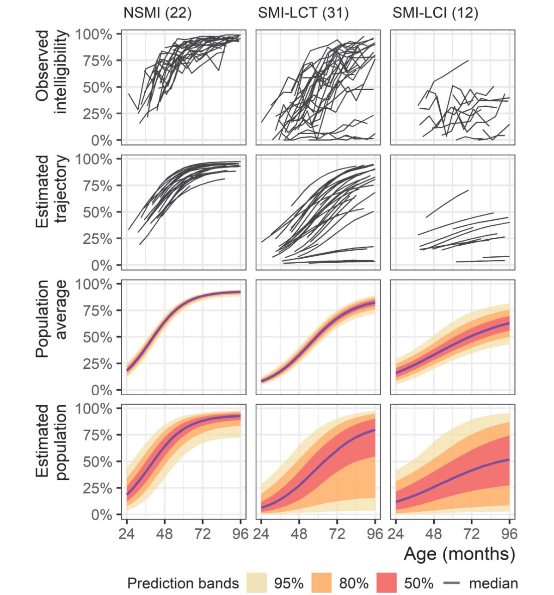
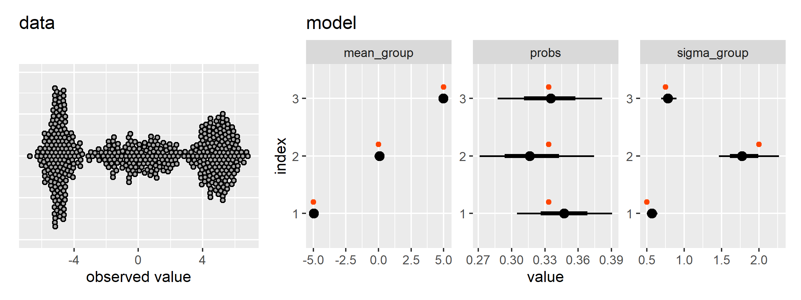
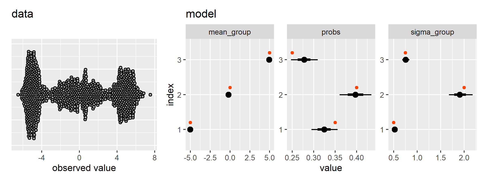

Latent class mixed effects models
================

This document/repository is an exercise in me “drawing the owl”, a
phrase used by Richard McElreath in the [Statistical
Rethinking](https://www.youtube.com/watch?v=FdnMWdICdRs&list=PLDcUM9US4XdPz-KxHM4XHt7uUVGWWVSus)
course to describe the process of the model development. This
statistical workflow involves simulating data, creating statistical
models to infer the unobserved parameters that generated the simulate
data, and gradually building up the model’s complexity. And we do this
model development *before* we plug the real data into the model.

## Background

In Mahr, Rathouz, and Hustad (2020), we examined the developmental
trajectories of speech intelligibility in three groups of children with
cerebral palsy: those without speech-motor impairment (NSMI), those with
speech-motor impairment and typical language comprehension (SMI-LCT),
and those with speech-motor impairment and impaired language
comprehension (SMI-LCI). We made these groupings based on clinical
judgment for NSMI/SMI status and language testing for LCT/LCI status. We
also tried to make the group assignments based on age-4 data whenever
possible to look at how the prospective/predictive value of the groups
on later growth trajectories.



The NSMI grouping is very successful: All of the children without
dysarthria seem following a homogeneous set of trajectories. The SMI-LCT
grouping seems to two have sets of trajectories: 1) trajectories that
are more spread out than the NSMI group but do show reliable growth in
intelligibility, and 2) 4–5 trajectories that show very limited growth.
The SMI-LCI group is less numerous than the other groups but it seems to
have a lower average trajectories than the others.

So, these groupings provide a coarse ordering for severity of
impairment, but can we do better? Actually, that’s not the right
question: Can we do different? What if instead we tell the statistical
model that there are K latent subgroups in our sample? Can it identify K
different groups? Is there evidence in the data for K groups? What about
K-1 or K+1 groups? Do the model-uncovered groups match up with our
previously defined groups? Those are just a few of the questions that
spring to mind.

I would like to apply a latent class mixed models approach to our
intelligibility trajectories but there is no off-the-shelf solution for
this problem, at least not one that can accommodate the nonlinear growth
model and beta distribution family I used in my prior analysis.

## Math of latent class mixed models

The [lcmm](https://cecileproust-lima.github.io/lcmm/) R package provides
a maximum-likelihood estimate for gaussian latent class mixed models, so
that is a good starting point for understanding these models.

Proust-Lima, Philipps, and Liquet (2017) describe the statistical
machinery for their latent class mixed models. We note the following
equations from their paper. Below is the likelihood contribution for one
individual (group) in the basic linear mixed model that we know and
love:

$$
\displaylines{
L_i = \phi_i(Y_i; \theta_1) \\
\phi: \textrm{MVN density} \\
i: \textrm{individual index}
}
$$

When there are $G$ latent classes, the likelihood becomes a weighted sum
of class-specific likelihoods:

$$
\displaylines{
L_i(\theta_G) = \sum_{g=1}^G \pi_{ig}\phi_{ig}(Y_i|c_i = g; \theta_G) \\
\pi_{ig}: \textrm{probability of group membership for an individual} \\
g: \textrm{group index}
}
$$

So, an individual makes $G$ contributions to the likelihood and each one
is weighted by their group membership probability. And when there is one
group, this equation reduces to the first likelihood equation.

Finally, group probabilities are defined as a multinomial logistic
model:

$$
\displaylines{
\pi_{ig} = 
  P(c_i = g | X_{ci}) = 
  \frac{
    e^{\xi_{0g} +X^{\top}_{ci}\xi_{1g}}
  }{
    \sum^{G}_{l=1}e^{\xi_{0l} +X^{\top}_{ci}\xi_{1l}}
  } \\
c_i : \textrm{the latent class for an individual} \\
X_{ci} : \textrm{time-indpendent covariates} \\
\xi_{0g} +X^{\top}_{ci}\xi_{1g} : \textrm{linear model for group membership}
}
$$

This model is something to worry about until later.

## Marginalization of discrete parameters

<!-- Stan uses Hamiltonian Monte Carlo (HMC) to sample from the posterior -->
<!-- distribution. HMC is conceptually [a physics -->
<!-- simulation](https://mc-stan.org/docs/reference-manual/hamiltonian-monte-carlo.html) -->
<!-- where a sampling chain explores the probability surface and its -->
<!-- gradients like a skateboarder rolling around a skatepark. -->

Stan [does not support sampling latent discrete
parameters](https://mc-stan.org/docs/stan-users-guide/latent-discrete.html),
and the latent group memberships above are discrete parameters. But we
don’t need them because we can average over them (or “marginalize” over
them).

Richard McElreath has a
[tutorial](https://elevanth.org/blog/2018/01/29/algebra-and-missingness/)
where observations are in different states but for some observations,
that state is missing/unobserved. He provides following recipe for how
work with discrete parameters in Stan:

<blockquote>

1)  Write the probability of an outcome `y[i]` conditional on known
    values of the discrete parameters. Call this $L$, the conditional
    likelihood.

2)  List all the possible states the discrete parameters could take. For
    example, if you have two binary parameters, then there are four
    possible states: 11, 10, 01, and 00. Let $j$ be an index for state,
    so that in this example $j$ can take the values 1, 2, 3, and 4.

3)  For each state in (2), compute the probability of that state. Your
    model provides these probabilities, and they will depend upon the
    details of your model. Call each state’s probability $P_j$.

4)  For each state in (2), compute the probability of an outcome `y[i]`
    when the discrete parameters take on those values. For example,
    there is a different probability for each of 11, 10, 01, and 00. You
    can use the expression from (1) and just insert the values of the
    parameters for each state. Call each state’s corresponding
    likelihood $L_j$.

5)  Now you can compute the unconditional probability of `y[i]` by
    multiplying each $P_j$ by $L_j$. Then sum these products for all
    states: $M=\sum_j P_j L_j$. This $M$ is the marginal likelihood, the
    probability of `y[i]` averaging over the unknown values of the
    discrete parameters.

In the actual code, we must do all of the above on the log-probability
scale, or otherwise numerical precision will be poor. So in practice
each $P_j L_j$ term is computed as a sum of log probabilities:
`term[j] = logP[j] + logL[j]`. And then we can compute $\log M$ as
`log_sum_exp(term).`
</blockquote>

Ben Lambert \[p.401–406\] also describes the process more generally:

<blockquote>

It is still possible to use \[discrete parameters in Stan\] by
marginalizing them out of the joint log density. This amounts to summing
the joint density over all possible values of the discrete parameter
$\theta$:

$$
p(\beta) = \sum_{i=1}^{k}p(\beta,\theta_i)
$$

However, we must do so on the log probability scale because this is what
Stan uses:

$$
\begin{align*}
\log p(\beta) &= \log \sum_{i=1}^{k} p(\beta, \theta_i) \\
&= \log \sum_{i=1}^{k}\exp (\log p(\beta, \theta_i)) \\
&= \texttt{log\\_sum\\_exp}(\log p(\beta, \theta_i))
\end{align*}
$$
</blockquote>

The thing I want to highlight from this formulation is that the left
sides of the equations contain a marginal probability of a continuous
parameter $\beta$ with no $\theta$s—hence “marginalization”. We sum over
all the values of the discrete parameter $\theta$ and no longer rely on
it.

## A Gaussian mixture model

Following that recipe and the notes from the lcmm package, I can do a
simple latent class model in Stan:

``` r
# knitr::opts_chunk$set(eval = FALSE)
```

``` r
m <- cmdstanr::cmdstan_model("0.stan")
```

``` stan
data {
  int<lower=1> n_obs;  // observations
  int<lower=1> n_groups;  // latent groups
  array[n_obs] real y;
}

transformed data {}

parameters {
  ordered[n_groups] mean_group;
  vector<lower=0>[n_groups] sigma_group;
  simplex[n_groups] probs;
}

transformed parameters {}

model {
  array[n_groups] real group_likelihoods;

  sigma_group ~ exponential(2);
  mean_group ~ normal(0, 10);
  probs ~ dirichlet(rep_vector(1.0, n_groups));

  for (i in 1:n_obs) {
    for (j in 1:n_groups) {
      group_likelihoods[j] = log(probs[j]) +
        normal_lpdf(y[i] | mean_group[j], sigma_group[j]);
    }
    target += log_sum_exp(group_likelihoods);
  }
}

generated quantities {
  matrix[n_obs, n_groups] g_probs;
  for (i in 1:n_obs) {
    vector[n_groups] terms;
    for (j in 1:n_groups) {
      terms[j] = log(probs[j]) +
        normal_lpdf(y[i] | mean_group[j], sigma_group[j]);
    }
    g_probs[i, ] = to_row_vector(softmax(terms));
  }
}
```

In the double for-loop in the model block, we perform the
marginalization recipe. We iterate through the observations and compute
weighted likelihoods for each group by multiplying the group probability
times the likelihood of the observation in that group.

Note also in the `parameters` block that the `mean_group` variable has
the type `ordered`. This constraint helps prevent the group ordering
from being randomly reordered on each posterior sample.

Let’s try to replicate the [Gaussian Mixture Model
demo](https://www.pymc.io/projects/examples/en/latest/mixture_models/gaussian_mixture_model.html)
from PyMC. First, we simulate the data and run the Stan model.

``` r
library(dplyr)
library(ggplot2)
library(patchwork)

# Simulate GMM data and bundle data-generating parameters in a table
gmm_setup <- function(n_groups, n_obs, means, sds, probs = NULL) {
  if (is.null(probs)) {
    probs <- rep(1 / n_groups, n_groups)
  }
  ids <- sample(1:n_groups, n_obs, replace = TRUE, prob = probs)
  y <- rnorm(n_obs, means[ids], sds[ids])

  true_values <- data.frame(
    parameter = c(
      sprintf("mean_group[%s]", 1:3),
      sprintf("probs[%s]", 1:3),
      sprintf("sigma_group[%s]", 1:3)
    ),
    ground_truth = c(means, probs, sds)
  )
  
  list(
    data_stan = list(
      n_obs = length(y),
      n_groups = n_groups,
      y = y
    ),
    data_truth = true_values
  )
}

gmm <- gmm_setup(
  n_groups = 3, 
  n_obs = 500, 
  means = c(-5, 0, 5), 
  sds = c(0.5, 2.0, 0.75)
)

posterior_gmm <- m$sample(gmm$data_stan, refresh = 0, parallel_chains = 4)
## Running MCMC with 4 parallel chains...
## Chain 4 Informational Message: The current Metropolis proposal is about to be rejected because of the following issue:
## Chain 4 Exception: normal_lpdf: Scale parameter is 0, but must be positive! (in 'C:/Users/Tristan/AppData/Local/Temp/RtmpUbzQJP/model-5510569341e5.stan', line 26, column 6 to line 27, column 58)
## Chain 4 If this warning occurs sporadically, such as for highly constrained variable types like covariance matrices, then the sampler is fine,
## Chain 4 but if this warning occurs often then your model may be either severely ill-conditioned or misspecified.
## Chain 4
## Chain 2 finished in 10.5 seconds.
## Chain 4 finished in 10.7 seconds.
## Chain 1 finished in 11.1 seconds.
## Chain 3 finished in 11.9 seconds.
## 
## All 4 chains finished successfully.
## Mean chain execution time: 11.1 seconds.
## Total execution time: 12.1 seconds.
```

Now we can plot the data and model estimates.

``` r
tidy_gmm_draws <- function(x) {
  x$draws() |> 
    posterior::as_draws_df() |>
    tibble::as_tibble() |> 
    select(
      .draw, .chain,
      starts_with("mean_"), 
      starts_with("probs"), 
      starts_with("sigma")
    ) |> 
    tidyr::pivot_longer(
      cols = c(-.draw, -.chain), 
      names_pattern = "(.+)\\[(\\d+)\\]",
      names_to = c("family", "index")
    ) |> 
    mutate(parameter = sprintf("%s[%s]", family, index))
}

plot_gmm_results <- function(data_draws, data_stan) {
  p <- ggplot(tibble(x = data_stan$y)) + 
    aes(x = x) + 
    ggdist::geom_swarm(color = "black") +
    ggtitle("data") +
    xlab("observed value") +
    theme(axis.text.y = element_blank(), axis.ticks.y = element_blank())

  p2 <- ggplot(data_draws) + 
    aes(x = value, y = index) + 
    ggdist::stat_pointinterval() + 
    facet_wrap("family", scales = "free") +
    geom_point(
      aes(x = ground_truth, color = "ground truth"), 
      position = position_nudge(y = .2),
      color = "orangered"
    ) +
    ggtitle("model") +
    guides(color = "none")

  p + p2 + plot_layout(widths = c(1, 2))
}

data_draws <- posterior_gmm |> 
  tidy_gmm_draws()  |> 
  left_join(gmm$data_truth, by = "parameter")

plot_gmm_results(data_draws, gmm$data_stan)
```



There is another PyMC demo that sets the sampling probabilities of the
groups too. Here is where the functions we defined above save us some
space.

``` r
gmm2 <- gmm_setup(
  n_groups = 3, 
  n_obs = 1000, 
  means = c(-5, 0, 5), 
  sds = c(0.5, 2.0, 0.75), 
  probs = c(0.35, 0.4, 0.25)
)

posterior_gmm2 <- m$sample(gmm2$data_stan, refresh = 0, parallel_chains = 4)
## Running MCMC with 4 parallel chains...
## Chain 1 Informational Message: The current Metropolis proposal is about to be rejected because of the following issue:
## Chain 1 Exception: normal_lpdf: Location parameter is inf, but must be finite! (in 'C:/Users/Tristan/AppData/Local/Temp/RtmpUbzQJP/model-5510569341e5.stan', line 26, column 6 to line 27, column 58)
## Chain 1 If this warning occurs sporadically, such as for highly constrained variable types like covariance matrices, then the sampler is fine,
## Chain 1 but if this warning occurs often then your model may be either severely ill-conditioned or misspecified.
## Chain 1
## Chain 1 Informational Message: The current Metropolis proposal is about to be rejected because of the following issue:
## Chain 1 Exception: normal_lpdf: Location parameter is inf, but must be finite! (in 'C:/Users/Tristan/AppData/Local/Temp/RtmpUbzQJP/model-5510569341e5.stan', line 26, column 6 to line 27, column 58)
## Chain 1 If this warning occurs sporadically, such as for highly constrained variable types like covariance matrices, then the sampler is fine,
## Chain 1 but if this warning occurs often then your model may be either severely ill-conditioned or misspecified.
## Chain 1
## Chain 2 Informational Message: The current Metropolis proposal is about to be rejected because of the following issue:
## Chain 2 Exception: normal_lpdf: Scale parameter is 0, but must be positive! (in 'C:/Users/Tristan/AppData/Local/Temp/RtmpUbzQJP/model-5510569341e5.stan', line 26, column 6 to line 27, column 58)
## Chain 2 If this warning occurs sporadically, such as for highly constrained variable types like covariance matrices, then the sampler is fine,
## Chain 2 but if this warning occurs often then your model may be either severely ill-conditioned or misspecified.
## Chain 2
## Chain 2 Informational Message: The current Metropolis proposal is about to be rejected because of the following issue:
## Chain 2 Exception: normal_lpdf: Scale parameter is 0, but must be positive! (in 'C:/Users/Tristan/AppData/Local/Temp/RtmpUbzQJP/model-5510569341e5.stan', line 26, column 6 to line 27, column 58)
## Chain 2 If this warning occurs sporadically, such as for highly constrained variable types like covariance matrices, then the sampler is fine,
## Chain 2 but if this warning occurs often then your model may be either severely ill-conditioned or misspecified.
## Chain 2
## Chain 3 Informational Message: The current Metropolis proposal is about to be rejected because of the following issue:
## Chain 3 Exception: normal_lpdf: Scale parameter is 0, but must be positive! (in 'C:/Users/Tristan/AppData/Local/Temp/RtmpUbzQJP/model-5510569341e5.stan', line 26, column 6 to line 27, column 58)
## Chain 3 If this warning occurs sporadically, such as for highly constrained variable types like covariance matrices, then the sampler is fine,
## Chain 3 but if this warning occurs often then your model may be either severely ill-conditioned or misspecified.
## Chain 3
## Chain 3 Informational Message: The current Metropolis proposal is about to be rejected because of the following issue:
## Chain 3 Exception: normal_lpdf: Scale parameter is 0, but must be positive! (in 'C:/Users/Tristan/AppData/Local/Temp/RtmpUbzQJP/model-5510569341e5.stan', line 26, column 6 to line 27, column 58)
## Chain 3 If this warning occurs sporadically, such as for highly constrained variable types like covariance matrices, then the sampler is fine,
## Chain 3 but if this warning occurs often then your model may be either severely ill-conditioned or misspecified.
## Chain 3
## Chain 4 Informational Message: The current Metropolis proposal is about to be rejected because of the following issue:
## Chain 4 Exception: normal_lpdf: Location parameter is inf, but must be finite! (in 'C:/Users/Tristan/AppData/Local/Temp/RtmpUbzQJP/model-5510569341e5.stan', line 26, column 6 to line 27, column 58)
## Chain 4 If this warning occurs sporadically, such as for highly constrained variable types like covariance matrices, then the sampler is fine,
## Chain 4 but if this warning occurs often then your model may be either severely ill-conditioned or misspecified.
## Chain 4
## Chain 3 finished in 17.8 seconds.
## Chain 1 finished in 18.2 seconds.
## Chain 4 finished in 19.9 seconds.
## Chain 2 finished in 29.1 seconds.
## 
## All 4 chains finished successfully.
## Mean chain execution time: 21.3 seconds.
## Total execution time: 29.2 seconds.

data_draws2 <- posterior_gmm2 |> 
  tidy_gmm_draws()  |> 
  left_join(gmm2$data_truth, by = "parameter")

plot_gmm_results(data_draws2, gmm2$data_stan)
```



## The gaussian mixed mixture model

Now let’s try a gaussian mixed effects mixture model. We have
repeated-measures observations drawn from k latent groups. First, let’s
validate the model in the $k=1$ case, which should reduce a random
intercept model.

``` r
# knitr::opts_chunk$set(eval = FALSE)
```

``` r
m <- cmdstanr::cmdstan_model("0-b.stan")
```

``` stan
data {
  int<lower=1> n_obs;
  int<lower=1> n_groups;
  int<lower=1> n_individuals;
  array[n_obs] int<lower=1, upper=n_individuals> individual;
  array[n_obs] real y;
}
transformed data {}
parameters {
  ordered[n_groups] mean_group;
  vector<lower=0>[n_groups] sigma_residuals;
  simplex[n_groups] probs;

  // the random intercepts start as z-scores
  array[n_groups] vector[n_individuals] standard_random_intercepts;
  // which are scaled for each group
  vector<lower=0>[n_groups] sigma_intercepts;
}
transformed parameters {
  // apply the actual scaling
  array[n_groups] vector[n_individuals] random_intercepts;
  for (i in 1:n_groups) {
    random_intercepts[i] = standard_random_intercepts[i] * sigma_intercepts[i];
  }
}
model {
  array[n_groups] real group_likelihoods;

  sigma_residuals ~ exponential(4);
  sigma_intercepts ~ exponential(4);
  mean_group ~ normal(0, 2);
  probs ~ dirichlet(rep_vector(5.0, n_groups));
  array[n_groups] vector[n_individuals] linear_terms;
  for (i in 1:n_groups) {
    standard_random_intercepts[i] ~ std_normal();
  }

  for (i in 1:n_individuals) {
    for (j in 1:n_groups) {
      linear_terms[j, i] = mean_group[j] + random_intercepts[j, i];
    }
  }

  for (i in 1:n_obs) {
    for (j in 1:n_groups) {
      group_likelihoods[j] = log(probs[j]) +
        normal_lpdf(y[i] | linear_terms[j, individual[i]], sigma_residuals[j]);
    }
    target += log_sum_exp(group_likelihoods);
  }
}
generated quantities {
  // matrix[n_obs, n_groups] g_probs;
  // for (i in 1:n_obs) {
  //   vector[n_groups] terms;
  //   for (j in 1:n_groups) {
  //     terms[j] = log(probs[j]) +
  //       normal_lpdf(y[i] | mean_group[j], sigma_group[j]);
  //   }
  //   g_probs[i, ] = to_row_vector(softmax(terms));
  // }
}
```

When I first fit this model, I didn’t get a good fit at first. Then
standardizing the observations fixed things. I suspect that the
observation scale (hundreds of milliseconds) didn’t work with my
hard-coded priors (wide for standardized variables).

``` r
# Borrow the sleepstudy dataset
d <- lme4::sleepstudy |> 
  mutate(
    y = Reaction |> scale() |> as.vector(),
    individual = match(Subject, unique(Subject))
  )

e <- m$sample(
  data = list(
    n_obs = nrow(d),
    n_groups = 1,
    n_individuals = length(unique(d$Subject)),
    individual = d$individual,
    y = d$y
  ), 
  parallel_chains = 4
)
## Running MCMC with 4 parallel chains...
## 
## Chain 1 Iteration:    1 / 2000 [  0%]  (Warmup) 
## Chain 2 Iteration:    1 / 2000 [  0%]  (Warmup) 
## Chain 3 Iteration:    1 / 2000 [  0%]  (Warmup) 
## Chain 4 Iteration:    1 / 2000 [  0%]  (Warmup)
## Chain 4 Informational Message: The current Metropolis proposal is about to be rejected because of the following issue:
## Chain 4 Exception: normal_lpdf: Scale parameter is 0, but must be positive! (in 'C:/Users/Tristan/AppData/Local/Temp/RtmpOUBM73/model-1b985d271aee.stan', line 46, column 6 to line 47, column 79)
## Chain 4 If this warning occurs sporadically, such as for highly constrained variable types like covariance matrices, then the sampler is fine,
## Chain 4 but if this warning occurs often then your model may be either severely ill-conditioned or misspecified.
## Chain 4
## Chain 1 Iteration:  100 / 2000 [  5%]  (Warmup) 
## Chain 1 Iteration:  200 / 2000 [ 10%]  (Warmup) 
## Chain 1 Iteration:  300 / 2000 [ 15%]  (Warmup) 
## Chain 1 Iteration:  400 / 2000 [ 20%]  (Warmup) 
## Chain 2 Iteration:  100 / 2000 [  5%]  (Warmup) 
## Chain 2 Iteration:  200 / 2000 [ 10%]  (Warmup) 
## Chain 2 Iteration:  300 / 2000 [ 15%]  (Warmup) 
## Chain 2 Iteration:  400 / 2000 [ 20%]  (Warmup) 
## Chain 3 Iteration:  100 / 2000 [  5%]  (Warmup) 
## Chain 3 Iteration:  200 / 2000 [ 10%]  (Warmup) 
## Chain 3 Iteration:  300 / 2000 [ 15%]  (Warmup) 
## Chain 4 Iteration:  100 / 2000 [  5%]  (Warmup) 
## Chain 4 Iteration:  200 / 2000 [ 10%]  (Warmup) 
## Chain 4 Iteration:  300 / 2000 [ 15%]  (Warmup) 
## Chain 4 Iteration:  400 / 2000 [ 20%]  (Warmup) 
## Chain 4 Iteration:  500 / 2000 [ 25%]  (Warmup) 
## Chain 1 Iteration:  500 / 2000 [ 25%]  (Warmup) 
## Chain 1 Iteration:  600 / 2000 [ 30%]  (Warmup) 
## Chain 2 Iteration:  500 / 2000 [ 25%]  (Warmup) 
## Chain 2 Iteration:  600 / 2000 [ 30%]  (Warmup) 
## Chain 2 Iteration:  700 / 2000 [ 35%]  (Warmup) 
## Chain 3 Iteration:  400 / 2000 [ 20%]  (Warmup) 
## Chain 3 Iteration:  500 / 2000 [ 25%]  (Warmup) 
## Chain 3 Iteration:  600 / 2000 [ 30%]  (Warmup) 
## Chain 4 Iteration:  600 / 2000 [ 30%]  (Warmup) 
## Chain 4 Iteration:  700 / 2000 [ 35%]  (Warmup) 
## Chain 4 Iteration:  800 / 2000 [ 40%]  (Warmup) 
## Chain 1 Iteration:  700 / 2000 [ 35%]  (Warmup) 
## Chain 1 Iteration:  800 / 2000 [ 40%]  (Warmup) 
## Chain 1 Iteration:  900 / 2000 [ 45%]  (Warmup) 
## Chain 2 Iteration:  800 / 2000 [ 40%]  (Warmup) 
## Chain 2 Iteration:  900 / 2000 [ 45%]  (Warmup) 
## Chain 2 Iteration: 1000 / 2000 [ 50%]  (Warmup) 
## Chain 2 Iteration: 1001 / 2000 [ 50%]  (Sampling) 
## Chain 3 Iteration:  700 / 2000 [ 35%]  (Warmup) 
## Chain 3 Iteration:  800 / 2000 [ 40%]  (Warmup) 
## Chain 3 Iteration:  900 / 2000 [ 45%]  (Warmup) 
## Chain 4 Iteration:  900 / 2000 [ 45%]  (Warmup) 
## Chain 4 Iteration: 1000 / 2000 [ 50%]  (Warmup) 
## Chain 4 Iteration: 1001 / 2000 [ 50%]  (Sampling) 
## Chain 4 Iteration: 1100 / 2000 [ 55%]  (Sampling) 
## Chain 1 Iteration: 1000 / 2000 [ 50%]  (Warmup) 
## Chain 1 Iteration: 1001 / 2000 [ 50%]  (Sampling) 
## Chain 1 Iteration: 1100 / 2000 [ 55%]  (Sampling) 
## Chain 2 Iteration: 1100 / 2000 [ 55%]  (Sampling) 
## Chain 3 Iteration: 1000 / 2000 [ 50%]  (Warmup) 
## Chain 3 Iteration: 1001 / 2000 [ 50%]  (Sampling) 
## Chain 3 Iteration: 1100 / 2000 [ 55%]  (Sampling) 
## Chain 4 Iteration: 1200 / 2000 [ 60%]  (Sampling) 
## Chain 4 Iteration: 1300 / 2000 [ 65%]  (Sampling) 
## Chain 1 Iteration: 1200 / 2000 [ 60%]  (Sampling) 
## Chain 1 Iteration: 1300 / 2000 [ 65%]  (Sampling) 
## Chain 2 Iteration: 1200 / 2000 [ 60%]  (Sampling) 
## Chain 2 Iteration: 1300 / 2000 [ 65%]  (Sampling) 
## Chain 3 Iteration: 1200 / 2000 [ 60%]  (Sampling) 
## Chain 4 Iteration: 1400 / 2000 [ 70%]  (Sampling) 
## Chain 1 Iteration: 1400 / 2000 [ 70%]  (Sampling) 
## Chain 1 Iteration: 1500 / 2000 [ 75%]  (Sampling) 
## Chain 2 Iteration: 1400 / 2000 [ 70%]  (Sampling) 
## Chain 2 Iteration: 1500 / 2000 [ 75%]  (Sampling) 
## Chain 3 Iteration: 1300 / 2000 [ 65%]  (Sampling) 
## Chain 3 Iteration: 1400 / 2000 [ 70%]  (Sampling) 
## Chain 4 Iteration: 1500 / 2000 [ 75%]  (Sampling) 
## Chain 4 Iteration: 1600 / 2000 [ 80%]  (Sampling) 
## Chain 1 Iteration: 1600 / 2000 [ 80%]  (Sampling) 
## Chain 1 Iteration: 1700 / 2000 [ 85%]  (Sampling) 
## Chain 2 Iteration: 1600 / 2000 [ 80%]  (Sampling) 
## Chain 2 Iteration: 1700 / 2000 [ 85%]  (Sampling) 
## Chain 3 Iteration: 1500 / 2000 [ 75%]  (Sampling) 
## Chain 3 Iteration: 1600 / 2000 [ 80%]  (Sampling) 
## Chain 4 Iteration: 1700 / 2000 [ 85%]  (Sampling) 
## Chain 4 Iteration: 1800 / 2000 [ 90%]  (Sampling) 
## Chain 1 Iteration: 1800 / 2000 [ 90%]  (Sampling) 
## Chain 1 Iteration: 1900 / 2000 [ 95%]  (Sampling) 
## Chain 2 Iteration: 1800 / 2000 [ 90%]  (Sampling) 
## Chain 3 Iteration: 1700 / 2000 [ 85%]  (Sampling) 
## Chain 3 Iteration: 1800 / 2000 [ 90%]  (Sampling) 
## Chain 4 Iteration: 1900 / 2000 [ 95%]  (Sampling) 
## Chain 4 Iteration: 2000 / 2000 [100%]  (Sampling) 
## Chain 4 finished in 1.1 seconds.
## Chain 1 Iteration: 2000 / 2000 [100%]  (Sampling) 
## Chain 2 Iteration: 1900 / 2000 [ 95%]  (Sampling) 
## Chain 2 Iteration: 2000 / 2000 [100%]  (Sampling) 
## Chain 3 Iteration: 1900 / 2000 [ 95%]  (Sampling) 
## Chain 3 Iteration: 2000 / 2000 [100%]  (Sampling) 
## Chain 1 finished in 1.2 seconds.
## Chain 2 finished in 1.3 seconds.
## Chain 3 finished in 1.3 seconds.
## 
## All 4 chains finished successfully.
## Mean chain execution time: 1.2 seconds.
## Total execution time: 1.3 seconds.
# e$summary() |> print(n = Inf)
e_sum <- e$summary(
  variables = c("mean_group", "sigma_intercepts", "sigma_residuals")
)
e_sum
## # A tibble: 3 × 10
##   variable       mean  median     sd    mad     q5   q95  rhat ess_bulk ess_tail
##   <chr>         <num>   <num>  <num>  <num>  <num> <num> <num>    <num>    <num>
## 1 mean_group… 0.00329 0.00231 0.160  0.154  -0.263 0.269  1.00    1139.    1605.
## 2 sigma_inte… 0.624   0.614   0.118  0.113   0.453 0.837  1.00    1325.    1663.
## 3 sigma_resi… 0.785   0.783   0.0439 0.0442  0.714 0.862  1.00    4574.    2565.
```

Compare with REML estimate.

``` r
lme4::lmer(y ~ 1 + (1 | Subject), d, REML = TRUE) |> 
  broom.mixed::tidy()
## # A tibble: 3 × 6
##   effect   group    term            estimate std.error statistic
##   <chr>    <chr>    <chr>              <dbl>     <dbl>     <dbl>
## 1 fixed    <NA>     (Intercept)     3.44e-16     0.161  2.14e-15
## 2 ran_pars Subject  sd__(Intercept) 6.35e- 1    NA     NA       
## 3 ran_pars Residual sd__Observation 7.86e- 1    NA     NA
```

``` r
gmmm_setup <- function(
  n_groups, 
  n_obs, 
  n_individuals, 
  means, 
  sd_resid, 
  sd_group, 
  probs = NULL
) {
  if (is.null(probs)) {
    probs <- rep(1 / n_groups, n_groups)
  }
  
  make_unscaler <- function(y) {
    z <- scale(y)
    center_value <- attr(z, "scaled:center")
    scale_value <- attr(z, "scaled:scale")
    function(x, center = TRUE, scale = TRUE) {
      if (!center) center_value <- 0
      if (!scale) scale_value <- 1
      (x * scale_value) + center_value
    }
  }
  make_rescaler <- function(y) {
    z <- scale(y)
    center_value <- attr(z, "scaled:center")
    scale_value <- attr(z, "scaled:scale")
    function(x, center = TRUE, scale = TRUE) {
      if (!center) center_value <- 0
      if (!scale) scale_value <- 1
      (x - center_value) / scale_value
    }
  }

  data_groups <- tibble::tibble(
    group = seq_len(n_groups),
    probs = probs,
    mean_group = means,
    sd_group = sd_group,
    sd_resid = sd_resid
  )

  data_individuals <- tibble::tibble(
    individual = seq_len(n_individuals),
    group = sample(1:n_groups, n_individuals, replace = TRUE, prob = probs)
  ) |> 
    left_join(data_groups, by = "group") |> 
    mutate(
      offset_individual = rnorm(n_individuals) * sd_group,
      mean_individual = mean_group + offset_individual
    )

    data_observed <- tibble::tibble(
      individual = sample(1:n_individuals, n_obs, replace = TRUE)
    ) |> 
      left_join(data_individuals, by = "individual") |> 
      mutate(
        y_raw = rnorm(n_obs, 0, sd_resid) + mean_individual,
        y = scale(y_raw) |> as.vector()
      )
  
    
  # true_values <- data.frame(
  #   parameter = c(
  #     sprintf("mean_group[%s]", 1:3),
  #     sprintf("probs[%s]", 1:3),
  #     sprintf("sigma_group[%s]", 1:3)
  #   ),
  #   ground_truth = c(means, probs, sds)
  # )
  
  list(
    data_stan = list(
      n_obs = n_obs,
      n_groups = n_groups,
      n_individuals = n_individuals,
      individual = data_observed$individual,
      y = data_observed$y
    ),
    data_groups = data_groups,
    data_individuals = data_individuals,
    data_observed = data_observed
  )
}

gmmm <- gmmm_setup(
  n_groups = 3, 
  n_obs = 400, 
  n_individuals = 60, 
  means = c(-5, 10, 20), 
  sd_group = c(4, 2, 1), 
  sd_resid = c(1, 1, 1)
)

ggplot(gmmm$data_observed) + 
  aes(x = fct_reorder(as.factor(individual), y), y = y) + 
  geom_point() +
  guides(x = "none") +
  labs(x = "individual")
```


``` r
  # geom_point(aes(y = (mean_group - mean(y_raw)) / sd(y_raw))) +
  # geom_segment(
  #   aes(
  #     x = individual, 
  #     xend = individual, 
  #     y = (mean_group - mean(y_raw)) / sd(y_raw), 
  #     yend = (mean_individual - mean(y_raw)) / sd(y_raw)
  #   )
  # )

# gmmm$data_observed
```

When I try to fit this model, all hell breaks loose. I need to figure
out how to constrain/identify it.

``` r
posterior_gmmm <- m$sample(
  gmmm$data_stan, 
  refresh = 200, 
  parallel_chains = 4, 
  max_treedepth = 15
)
## Running MCMC with 4 parallel chains...
## 
## Chain 1 Iteration:    1 / 2000 [  0%]  (Warmup)
## Chain 1 Informational Message: The current Metropolis proposal is about to be rejected because of the following issue:
## Chain 1 Exception: normal_lpdf: Scale parameter is 0, but must be positive! (in 'C:/Users/Tristan/AppData/Local/Temp/RtmpOUBM73/model-1b985d271aee.stan', line 46, column 6 to line 47, column 79)
## Chain 1 If this warning occurs sporadically, such as for highly constrained variable types like covariance matrices, then the sampler is fine,
## Chain 1 but if this warning occurs often then your model may be either severely ill-conditioned or misspecified.
## Chain 1
## Chain 2 Iteration:    1 / 2000 [  0%]  (Warmup) 
## Chain 3 Iteration:    1 / 2000 [  0%]  (Warmup)
## Chain 3 Informational Message: The current Metropolis proposal is about to be rejected because of the following issue:
## Chain 3 Exception: normal_lpdf: Scale parameter is 0, but must be positive! (in 'C:/Users/Tristan/AppData/Local/Temp/RtmpOUBM73/model-1b985d271aee.stan', line 46, column 6 to line 47, column 79)
## Chain 3 If this warning occurs sporadically, such as for highly constrained variable types like covariance matrices, then the sampler is fine,
## Chain 3 but if this warning occurs often then your model may be either severely ill-conditioned or misspecified.
## Chain 3
## Chain 4 Iteration:    1 / 2000 [  0%]  (Warmup)
## Chain 4 Informational Message: The current Metropolis proposal is about to be rejected because of the following issue:
## Chain 4 Exception: normal_lpdf: Scale parameter is 0, but must be positive! (in 'C:/Users/Tristan/AppData/Local/Temp/RtmpOUBM73/model-1b985d271aee.stan', line 46, column 6 to line 47, column 79)
## Chain 4 If this warning occurs sporadically, such as for highly constrained variable types like covariance matrices, then the sampler is fine,
## Chain 4 but if this warning occurs often then your model may be either severely ill-conditioned or misspecified.
## Chain 4
## Chain 3 Iteration:  200 / 2000 [ 10%]  (Warmup) 
## Chain 1 Iteration:  200 / 2000 [ 10%]  (Warmup) 
## Chain 3 Iteration:  400 / 2000 [ 20%]  (Warmup) 
## Chain 1 Iteration:  400 / 2000 [ 20%]  (Warmup) 
## Chain 3 Iteration:  600 / 2000 [ 30%]  (Warmup) 
## Chain 1 Iteration:  600 / 2000 [ 30%]  (Warmup) 
## Chain 3 Iteration:  800 / 2000 [ 40%]  (Warmup) 
## Chain 2 Iteration:  200 / 2000 [ 10%]  (Warmup) 
## Chain 1 Iteration:  800 / 2000 [ 40%]  (Warmup) 
## Chain 3 Iteration: 1000 / 2000 [ 50%]  (Warmup) 
## Chain 3 Iteration: 1001 / 2000 [ 50%]  (Sampling) 
## Chain 3 Iteration: 1200 / 2000 [ 60%]  (Sampling) 
## Chain 1 Iteration: 1000 / 2000 [ 50%]  (Warmup) 
## Chain 1 Iteration: 1001 / 2000 [ 50%]  (Sampling) 
## Chain 1 Iteration: 1200 / 2000 [ 60%]  (Sampling) 
## Chain 3 Iteration: 1400 / 2000 [ 70%]  (Sampling) 
## Chain 1 Iteration: 1400 / 2000 [ 70%]  (Sampling) 
## Chain 3 Iteration: 1600 / 2000 [ 80%]  (Sampling) 
## Chain 1 Iteration: 1600 / 2000 [ 80%]  (Sampling) 
## Chain 3 Iteration: 1800 / 2000 [ 90%]  (Sampling) 
## Chain 4 Iteration:  200 / 2000 [ 10%]  (Warmup) 
## Chain 1 Iteration: 1800 / 2000 [ 90%]  (Sampling) 
## Chain 3 Iteration: 2000 / 2000 [100%]  (Sampling) 
## Chain 3 finished in 107.0 seconds.
## Chain 1 Iteration: 2000 / 2000 [100%]  (Sampling) 
## Chain 1 finished in 107.3 seconds.
## Chain 2 Iteration:  400 / 2000 [ 20%]  (Warmup) 
## Chain 4 Iteration:  400 / 2000 [ 20%]  (Warmup) 
## Chain 4 Iteration:  600 / 2000 [ 30%]  (Warmup) 
## Chain 2 Iteration:  600 / 2000 [ 30%]  (Warmup) 
## Chain 4 Iteration:  800 / 2000 [ 40%]  (Warmup) 
## Chain 4 Iteration: 1000 / 2000 [ 50%]  (Warmup) 
## Chain 4 Iteration: 1001 / 2000 [ 50%]  (Sampling) 
## Chain 2 Iteration:  800 / 2000 [ 40%]  (Warmup) 
## Chain 4 Iteration: 1200 / 2000 [ 60%]  (Sampling) 
## Chain 2 Iteration: 1000 / 2000 [ 50%]  (Warmup) 
## Chain 2 Iteration: 1001 / 2000 [ 50%]  (Sampling) 
## Chain 4 Iteration: 1400 / 2000 [ 70%]  (Sampling) 
## Chain 2 Iteration: 1200 / 2000 [ 60%]  (Sampling) 
## Chain 4 Iteration: 1600 / 2000 [ 80%]  (Sampling) 
## Chain 4 Iteration: 1800 / 2000 [ 90%]  (Sampling) 
## Chain 2 Iteration: 1400 / 2000 [ 70%]  (Sampling) 
## Chain 4 Iteration: 2000 / 2000 [100%]  (Sampling) 
## Chain 4 finished in 477.5 seconds.
## Chain 2 Iteration: 1600 / 2000 [ 80%]  (Sampling) 
## Chain 2 Iteration: 1800 / 2000 [ 90%]  (Sampling) 
## Chain 2 Iteration: 2000 / 2000 [100%]  (Sampling) 
## Chain 2 finished in 555.3 seconds.
## 
## All 4 chains finished successfully.
## Mean chain execution time: 311.8 seconds.
## Total execution time: 555.4 seconds.
## Warning: 157 of 4000 (4.0%) transitions ended with a divergence.
## See https://mc-stan.org/misc/warnings for details.

draws <- posterior_gmmm$draws() |> 
  posterior::as_draws_df()

bayesplot::mcmc_dens_chains(draws, vars(starts_with("mean_group")))
```


``` r
bayesplot::mcmc_dens_chains(draws, vars(starts_with("probs")))
```


``` r
bayesplot::mcmc_dens_chains(draws, vars(starts_with("sigma")))
```


``` r


# e <- posterior_gmmm$summary()
# e |> print(n = 20)
# 
# 
# e |> 
#   filter(
#     variable |> startsWith("mean_") | 
#     variable |> startsWith("sigma") |
#     variable |> startsWith("probs") 
#   ) |> 
#   ggplot() + 
#   aes(x = median) +
#   geom_segment(aes(y = variable, yend = variable, x = q5, xend = q95)) +
#   geom_point(aes(y = variable)) +
#   geom_point(
#     aes(
#       y = sprintf("mean_group[%s]", group),
#       x = rescale(mean_group)
#     ),
#     data = gmmm$data_groups,
#     color = "orangered"
#   ) +
#   geom_point(
#     aes(
#       y = sprintf("sigma_intercepts[%s]", group),
#       x = rescale(sd_group, center = FALSE)
#     ),
#     data = gmmm$data_groups,
#     color = "orangered"
#   ) +
#   geom_point(
#     aes(
#       y = sprintf("sigma_residuals[%s]", group),
#       x = rescale(sd_group, center = FALSE)
#     ),
#     data = gmmm$data_groups,
#     color = "orangered"
#   )

# m2 <- brm(
#   formula = y ~ 1 + (1|individual), 
#   data = gmmm$data_observed,
#   family = mixture(gaussian(), gaussian()), 
#   backend = "cmdstanr"
# )
```

<div id="refs" class="references csl-bib-body hanging-indent">

<div id="ref-mahr2020" class="csl-entry">

Mahr, Tristan J., Paul J. Rathouz, and Katherine C. Hustad. 2020.
“Longitudinal Growth in Intelligibility of Connected Speech from 2 to 8
Years in Children with Cerebral Palsy: A Novel Bayesian Approach.”
*Journal of Speech, Language, and Hearing Research* 63 (9): 2880–93.
[https://doi.org/10.1044/2020\\\_JSLHR-20-00181](https://doi.org/10.1044/2020\_JSLHR-20-00181).

</div>

<div id="ref-JSSv078i02" class="csl-entry">

Proust-Lima, Cécile, Viviane Philipps, and Benoit Liquet. 2017.
“Estimation of Extended Mixed Models Using Latent Classes and Latent
Processes: The r Package Lcmm.” *Journal of Statistical Software* 78
(2): 1–56. <https://doi.org/10.18637/jss.v078.i02>.

</div>

</div>
